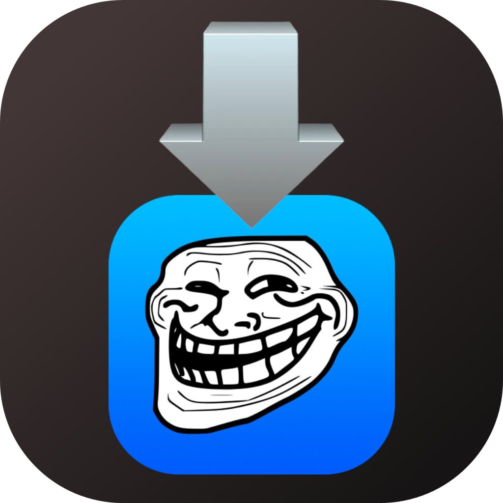

    <h1>TrollInstallerDark</h1>
    

# This repo is the only offical source to download TrollInstallerDark. Do not trust any other source.

## Overview
TrollInstallerDark is a modification of Alfie's [TrollInstallerX](https://github.com/alfiecg24/TrollInstallerX) to use the [DarkSword kernel exploit.](https://github.com/opa334/darksword-kexploit)

TrollInstallerDark only supports arm64 devices running iOS 15.7.2 - 15.8.x. TrollStore is installed directly to the Home Screen and a persistence helper is registered into a system app of your choosing.

## Usage
TrollInstallerDark is extremely easy to use. Simply download the latest release from the Releases page, and sideload it using your preferred method. Once installed, open the app and press the "Install" button. From there, TrollStore and its persistence helper will be installed onto your device.

## FAQ
> Why am I stuck at "Exploiting kernel"?

Try restarting your device, if this issue persists and you're on a supported device, please file a GitHub issue.

> Why can I not open/see TrollStore after a successful installation?

During installation, you will have installed a persistence helper. Open your persistence helper and press "refresh app registrations" to fix TrollStore not being able to be opened.

> Why did the app I selected for the persistence helper not become the persistence helper?

If you selected an app for the persistence helper and it did not change, it is likely that you already have a persistence helper installed. Open TrollStore and go to settings to see which app is set to the persistence helper.

## Building
TrollInstallerDark is a regular Xcode project, but the project also contains a build script. To build it and produce an IPA, simply run the `build.sh` script in the root of the project. This will build the project and produce an IPA in the root of the project.

## Credits
Thanks to these people for TrollInstallerDark:

* [alfiecg24](https://github.com/alfiecg24) for [TrollInstallerX](https://github.com/alfiecg24/TrollInstallerX) in the first place
* [opa334](https://github.com/opa334) for the [DarkSword kernel exploit implementation](https://github.com/opa334/darksword-kexploit)
* [forcequit](https://github.com/forcequitOS) for slightly helping and writing this readme :p

Original credits for TrollInstallerX:

* [opa334](https://x.com/opa334dev) for [Dopamine](https://github.com/opa334/Dopamine), the dmaFail exploit and the kernel patchfinder
* [felix-pb](https://github.com/felix-pb) for the kfd exploits
* [Kaspersky](https://securelist.com/operation-triangulation-the-last-hardware-mystery/111669/) for Operation Triangulation
* [kok3shidoll](https://github.com/kok3shidoll) for lots of work on arm64 support for Dopamine
* [wh1te4ever](https://github.com/wh1te4ever) for [kfund](https://github.com/wh1te4ever/kfund)
* [Zhuowei](https://github.com/zhuowei) for the tccd unsandboxing method
* [xina520](https://x.com/xina520) for the kernel read/write-only privilege escalation method
* [dhinakg](https://github.com/dhinakg) for the memory hogger, the MacDirtyCow kernelcache grabber method, [libpartial](https://github.com/dhinakg/partial) and help with [libgrabkernel2](https://github.com/alfiecg24/libgrabkernel2)
* [staturnz](https://github.com/staturnzz) for work on the kernel patchfinder
* [aaronp613](https://x.com/aaronp613) for the TrollInstallerX icon
* [DTCalabro](https://github.com/DTCalabro) and [JJTech](https://github.com/JJTech0130) for improvements to the logging system
* [MasterMike88](https://x.com/MasterMike88) for helping test and debug during development

AI assistance was used to integrate DarkSword with TrollInstallerX, everything else is fully human effort, this shouldn't brick your device.
